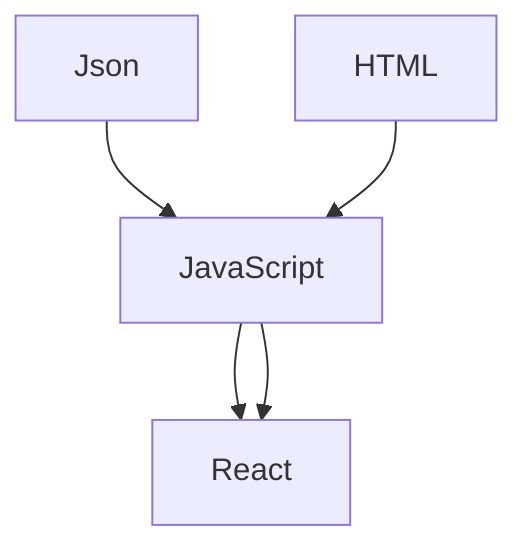

# SpeedCode 

Speed code é uma Extensão de Snippets, feita para a programação em linguagens diferente.


<div align="center">

</div>

# Linguage

Essa extensão esta em totalmente em construção pode conter mas support a linguagens como: Python, C#, C++, PHP

| Linguagem | Versão | Ultima Atualização | Comando Global |
| :---         |     :---:      |          :---: |  :---: |
| Html5   | 0.0.1     | 22/nov/22    | Redme/html | 
| Javascript     | 0.0.1       | 22/nov/22      | Redme/javaScript | 
| React Native     | 0.0.1        | 22/nov/22      | Redme/reactnative | 

## Notas de versão

Estamos ainda formando a primeira versão dessa Extensão

### 1.0.0

Formação inicial com diversidade de Comandos ( Adicionados )

## Suporte da Extensão a versão do VScode 

### ^1.73.0
## Diagrama de Utilização da Extensão e inplementação nos códigos

Permissão de uso em diferentes linguagens: 



## Corrigindo Erros

- [x] Support a PHP
- [x] Erro de Sintase JavaScript
- [x] Adicionado JQuery

#### Ajude nós melhorar essa Extensão 

```ruby
   echo "Você pode mandar para nós ideias para adicionar a Extensão! Vocês é quem fazem essa Extensão"
```
